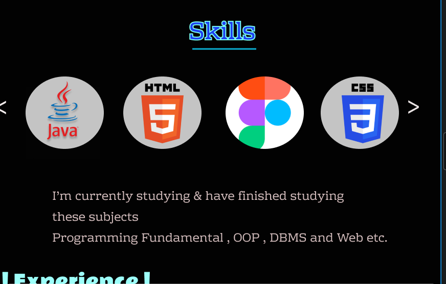
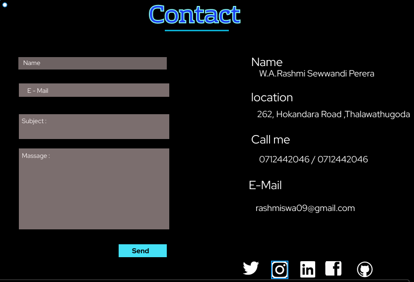

  

<h1 align="center">Hi , I'm Rashmi Sewwandi</h1>
<h3 align="center">I'm a Software Developer from Sri Lanka</h3>

## 🙋‍️ About Me
- 🔭 I’m currently education on **[IJSE(Institute of Software Engineering)](https://www.ijse.lk/)**
- 🌱 I’m currently learning **Web development**
- 📫 How to reach me **rashmiswa09@gmail.com**

-<h3 align="center">Home</h3>
-

-<h3 align="center">About Me</h3>
-

-<h3 align="center">Educations</h3>
-

-<h3 align="center">Skills & Experience</h3>
-

-<h3 align="center">Projects</h3>
-

-<h3 align="center">Contact</h3>
-

## :link: **Links**
- Website : [rashmisewwandi](https://rashmisewwandi.000webhostapp.com)
- GitHub-Pages : [RashmiSewwandi.github.io](https://github.com/RashmiSewwandi/RashmiSewwandi)
- Site Map : [Click Here](https://www.gloomaps.com/VMb9EpDD9n )
- Wireframe : [Click Here](https://wireframe.cc/EyO2rt)
- Mockup : [Click Here](https://www.figma.com/file/z9JVhV3bFu3XkEBirozofA/Rashmi?node-id=0%3A1)

  

